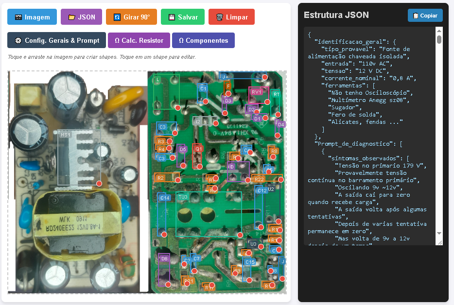

<!--
Label: 🚀 PCB Mapper, Sistema de Diagnóstico e Reparo de Circuitos Eletrônicos Assistido por IA
Description: [uma Descrição do projeto]: Desenvolvimento de uma plataforma web avançada para mapeamento de PCBs, análise de esquemas e suporte ao diagnóstico e reparo de circuitos eletrônicos com auxílio de Inteligência Artificial, contando com ferramentas auxiliares de cálculo.
technical_requirement: [os requerimetos]: Diagnóstico de Falhas, Engenharia Reversa de Hardware, Análise de Circuitos, Manipulação de JSON, Lógica de Programação.
skills: [as competências]: Resolução de Problemas, Pensamento Crítico e Análise, Diagnóstico e Manutenção de Equipamentos, Aprendizado Contínuo.
professions: [as profissões]: Engenheiro(a) de Hardware, Técnico(a) de Manutenção Eletrônica, Engenheiro(a) Eletricista, Desenvolvedor(a) de Sistemas de Diagnóstico.
Tags: Fund, Dev, Skils
path_hook: hookfigma.hook5, hookfigma.hook8, hookfigma.hook9, hookfigma.hook12
-->

[](https://developer.mozilla.org/en-US/docs/Web/HTML)
[](https://tailwindcss.com/)
[](https://developer.mozilla.org/en-US/docs/Web/JavaScript)
[](https://developer.android.com/)


## ⚡ Visão Geral do Projeto (`PCB Mapper`)

O **PCB Mapper** é uma solução especializada projetada para servir como base de dados e interface para uma **Inteligência Artificial diagnosticar e reparar circuitos eletrônicos**. O sistema integra arquivos estruturados de projetos (como fontes e layouts em JSON), mapeamento físico de placas de circuito impresso e ferramentas auxiliares (como o calculador de resistores) para fornecer à IA o contexto completo necessário na identificação de falhas e planejamento de reparos.

---

<p align="center">
  
</p>

---

### 🎨 Funcionalidades e Características Principais

* **Mapeamento de PCB:** Interface visual dedicada para documentar, rastrear e organizar conexões e componentes de placas de circuito impresso.
* **Calculadora de Resistores (ResistorCalc Pro):** 
  * Suporte completo para resistores de 4 e 5 bandas.
  * Representação gráfica dinâmica em SVG com atualização em tempo real das cores.
  * Seleção inteligente por cores, *presets* comerciais e inversão de leitura.
  * Cálculo automático de faixa de tolerância e ferramenta de cópia rápida para a área de transferência.
* **Gerenciamento de Dados (JSON):** Suporte a arquivos de configuração e esquemas estruturados (`fonte_12_v0_8a.json`, etc.) para carregar e salvar projetos de circuitos.
* **Design Moderno e Adaptativo:** Interface limpa em tons escuros (*Slate*), perfeita para uso em bancadas eletrônicas, computadores ou embutida em aplicações mobile.

---

### 📊 Tabela: Os Principais Insights Chaves

| Pergunta / Desafio | Resposta | Insights Acionáveis |
| :--- | :---: | :--- |
| **O sistema fornece contexto para uma IA atuar no reparo?** | Sim | Utiliza dados estruturados de circuitos (`pcb_mapper.html` e arquivos JSON) para alimentar a IA com informações precisas sobre a placa sob teste. |
| **A aplicação agiliza a identificação de componentes defeituosos?** | Sim | Combina o mapeamento visual do circuito com ferramentas auxiliares de cálculo para acelerar os testes de bancada. |
| **É possível rastrear esquemas complexos de fontes e placas?** | Sim | O uso de arquivos de dados detalhados permite mapear fluxos de energia e pontos críticos de falha no circuito. |

---

### 📚 Jargões e Termos Relevantes

| Termo / Jargão | Explicação Concisa |
| :--- | :--- |
| **Diagnóstico de Circuitos** | Processo sistemático de identificação de falhas, curtos ou componentes danificados em uma placa eletrônica. |
| **Engenharia Reversa de Hardware** | Análise minuciosa de uma placa de circuito impresso para compreender seu funcionamento e mapear suas conexões para reparo. |
| **Curto-Circuito** | Caminho de baixa resistência indesejado em um circuito que provoca fluxo excessivo de corrente e falha no sistema. |
| **Placa de Circuito Impresso (PCB)** | Base estrutural que sustenta eletricamente e conecta os componentes eletrônicos por meio de trilhas de cobre. |

---

### 📂 Estrutura do Projeto

```text
pcb_mapper/
├── pcb_mapper.html           # Aplicação principal (Central do PCB Mapper)
├── resistor_calculator.html  # Módulo utilitário: Calculadora de Cores de Resistores
├── fonte_12_v0_8a.json       # Arquivos de dados e esquemas de circuitos
├── fonte_12_v0_8a_3.json     # Variações e histórico de dados de fontes
└── README.md                 # Documentação oficial do projeto

```

### 🛠️ Como Utilizar
Por ter sido projetado para integração nativa em aplicações (como assets Android) ou uso autônomo, você pode executá-lo diretamente pelo navegador:

Clone ou baixe o repositório do projeto.

Abra o arquivo pcb_mapper.html em qualquer navegador web moderno (Google Chrome, Firefox, Edge, etc.).

Utilize os módulos integrados para gerenciar seus mapeamentos de PCB ou acesse a calculadora de resistores para suporte rápido na bancada.


### 📄 Licença
Este projeto está sob a licença MIT. Sinta-se à vontade para utilizar, modificar e expandir para suas próprias ferramentas de desenvolvimento de hardware.

---
